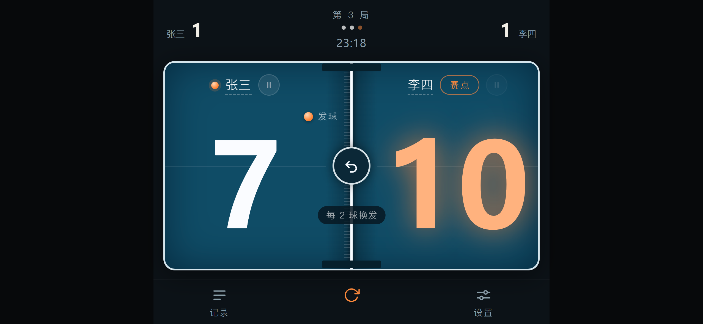
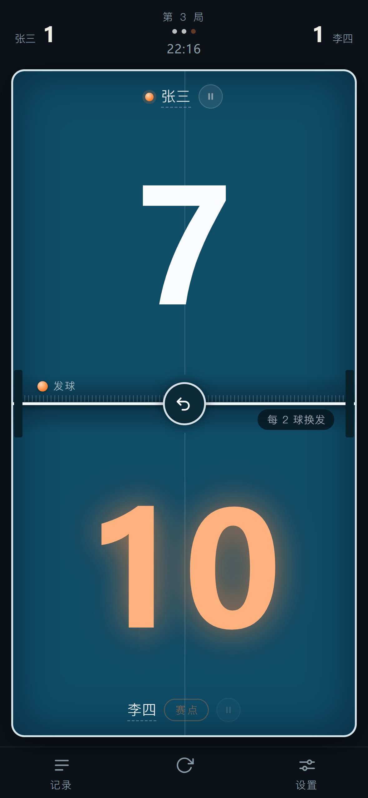
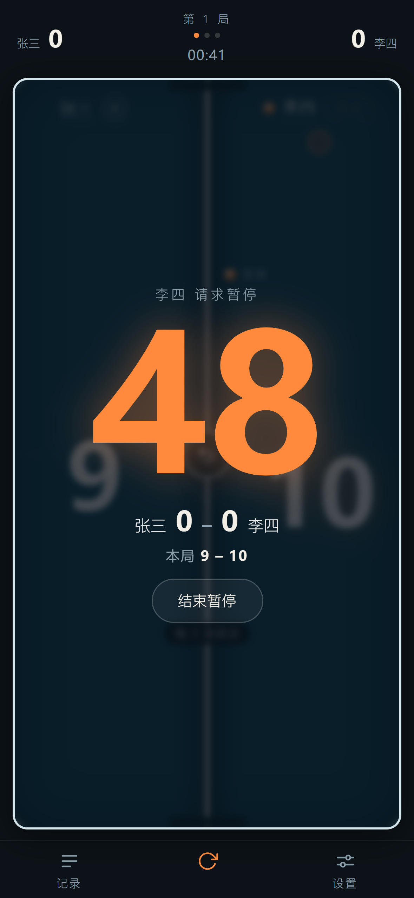
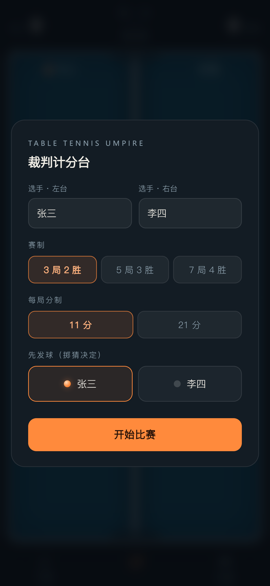
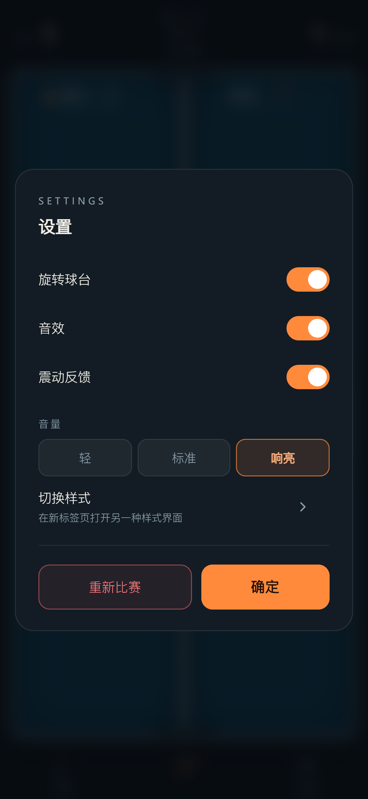
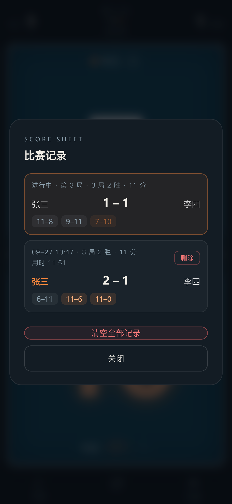
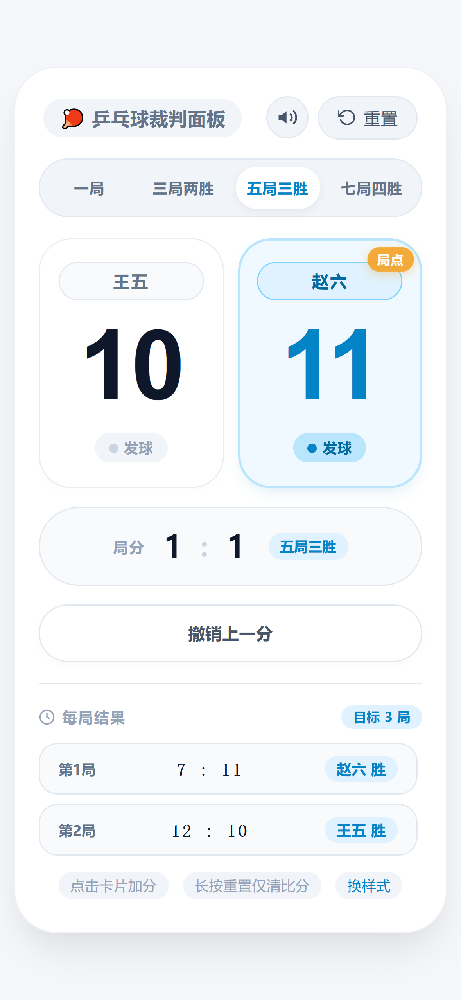

# 🏓 乒乓球裁判计分台

一个面向乒乓球比赛的**纯静态计分面板**。零依赖、零构建，所有逻辑都写在一个 HTML 文件里，用手机浏览器打开即可当裁判计分台使用。

## DEMO

<table>
  <tr>
    <td align="center" colspan="3">
      <br>
      <b>横屏</b>
    </td>
  </tr>

  <tr>
    <td align="center">
      <br>
      <b>竖屏</b>
    </td>
    <td align="center">
      <br>
      <b>暂停</b>
    </td>
    <td align="center">
      <br>
      <b>初始</b>
    </td>
  </tr>
  <tr>
    <td align="center">
      <br>
      <b>设置</b>
    </td>
    <td align="center">
      <br>
      <b>记录</b>
    </td>
    <td align="center">
      <br>
      <b>样式二</b>
    </td>
  </tr>
</table>

项目包含**两套外观**，功能各有侧重，可以在运行时互相跳转：

| 文件 | 风格 | 定位 |
| --- | --- | --- |
| `index.html` | 深色「球台」拟物界面 | 主版本，功能完整，适合正式比赛执裁 |
| `2.html` | 浅色卡片式界面 | 轻量变体，操作直观，适合日常练习 / 教学 |

> 默认入口是 `index.html`（根路径 `/` 会直接加载它）。

---

## 快速开始

无需安装任何东西，也不需要 Node / 构建工具。

```bash
# 方式一：直接用浏览器打开
open index.html

# 方式二：起一个静态服务器（推荐，便于手机同局域网访问）
python3 -m http.server 8080
# 然后访问 http://<本机IP>:8080/
```

手机访问时建议把页面「添加到主屏幕」，全屏运行更接近实体计分台。

---

## 目录结构

```
pingpong-socre/
├── index.html   # 深色主版本（裁判计分台）
├── 2.html       # 浅色变体
```

---

## index.html · 深色裁判计分台

整块屏幕就是一张球台：竖屏时分为上下半台，横屏时分为左右半台。**点哪一半，就给哪位选手加 1 分。**

### 主要能力

- **赛制**：3 局 2 胜 / 5 局 3 胜 / 7 局 4 胜
- **分制**：11 分制 / 21 分制（自动适配换发球节奏）
- **球台方向**：底栏一键在「竖置（上下半台）」和「横置（左右半台）」之间切换，设置里也有开关
- **发球指示**：球网上有橙色小球与「发球」标签，实时标注当前发球方；网旁文字同步提示换发规则
- **局点 / 赛点**：到达局点比分发光，赛点整体转暖色，选手名旁弹出「局点 / 赛点」徽章
- **暂停**：每位选手每场各 1 次、每次 60 秒。按钮就在各自半台的姓名旁边，点击后中央弹出全屏倒计时遮罩，**暂停期间比赛计时停走且不接受计分**
- **计时器**：顶栏中央显示比赛用时，可点击手动暂停 / 继续
- **撤销**：球网中央的圆形按钮，或键盘 `Z`。可连续撤销多分，撤销到赛点分时会自动撤回已归档的比赛记录
- **比赛记录**：底栏「记录」打开。当前场次实时显示，已结束的场次归档到本地，**跨场次累积**，支持单场删除与一键清空
- **改名**：点击球台上的选手姓名即可修改（最多 8 字）
- **音效与震动**：得分 / 局末 / 赛末三种提示音，音量三档可调，震动反馈可单独开关
- **屏幕常亮**：比赛中通过 Wake Lock 防止手机自动息屏（需浏览器支持）
- **自动存档**：比分、局分、计时、撤销栈全部写入 `localStorage`，刷新或误触返回都不会丢；重新打开会提示「已恢复上一场比赛」
- **键盘快捷键**：见下方

### 快捷键

| 按键 | 作用 |
| --- | --- |
| `A` / `1` / `↑` / `←` | 选手 A（上半台 / 左半台）加 1 分 |
| `B` / `2` / `↓` / `→` | 选手 B（下半台 / 右半台）加 1 分 |
| `Z` / `Backspace` | 撤销 1 分 |
| `Ctrl/Cmd + Z` | 撤销 1 分 |
| `空格` | 暂停 / 继续比赛计时 |
| `H` | 打开比赛记录 |
| `S` | 打开设置 |
| `Enter` | 开始比赛 / 确认输入框 |
| `Esc` | 关闭浮层 |

---

## 2.html · 浅色轻量变体

左右两张选手卡片，点卡片加分。界面更直白，适合边看边讲。

### 与 index.html 的差异

- **赛制**：一局定胜负 / 三局两胜 / 五局三胜 / 七局四胜
- **分制**：固定 11 分制（不支持 21 分）
- **局分条**：中间有大号「局分 X : Y」显示条
- **局间流程**：每局结束后弹出黄色提示条 + 绿色「确认开局」按钮，必须手动确认才进入下一局
- **每局结果**：页面内嵌列表，展示本场各局比分与胜者（**仅本场，不跨场次累积**）
- **重置按钮**：
  - **单击** → 二次确认后清空全部（比分 + 局分 + 记录）
  - **长按 600ms** → 只清本局比分
- **音效**：只有开关，无震动、无音量调节
- **撤销**：只能撤销当前未结束的这一局
- **自动存档**：同样写入 `localStorage`（键名与 index 不同，两者互不干扰）

---

## 功能对照

| 功能 | index.html | 2.html |
| --- | :---: | :---: |
| 11 分制 | ✅ | ✅ |
| 21 分制 | ✅ | ❌ |
| 局制选择 | 3 / 5 / 7 局 | 1 / 3 / 5 / 7 局 |
| 发球方指示 | ✅ | ✅ |
| 局点 / 赛点提示 | ✅ | ✅ |
| 计时器 | ✅ | ❌ |
| 暂停（60 秒倒计时） | ✅ | ❌ |
| 撤销 | 多分连续撤销 | 本局内撤销 |
| 比赛记录 | 跨场次归档 | 仅本场 |
| 球台横置 | ✅ | ❌（固定左右布局） |
| 震动反馈 / 音量调节 | ✅ | ❌ |
| 屏幕常亮 | ✅ | ❌ |
| 键盘快捷键 | ✅ | ✅ |
| 自动存档 | ✅ | ✅ |

---

## 规则实现说明

两套界面共用同一套 ITTF 判分逻辑，具体细节：

- **换发球**：11 分制每 2 球换发，21 分制每 5 球换发。
- **平分（Deuce）**：双方均到达 `目标分 - 1`（11 分制即 10:10）后，改为**每 1 球换发**，且必须净胜 2 分才能赢下该局。
- **下一局先发球**：发球权在双方之间**轮换**，与谁赢下本局无关。
- **局末 / 赛末**：赢下一局后弹出本局比分与「进入下一局」；赢得足够局数后弹出全场结果、各局比分与总用时。
- **换边（ITTF 2.13.7）**：每局结束、以及决胜局一方先到 5 分（21 分制为 10 分）时，界面只弹提示「双方交换场地」，**不会自动对调两半台的选手位置**——面板始终固定代表同一位选手，避免比赛中界面自行跳动，位置由裁判自行记住。

---

## 数据存储

所有数据都保存在浏览器本地，不上传服务器。清除浏览器数据即会丢失。

| localStorage 键 | 使用者 | 内容 |
| --- | --- | --- |
| `ppscore.v1` | index.html | 当前场次的比分、局分、计时、撤销栈、设置 |
| `ppscore.matches.v1` | index.html | 跨场次的历史比赛档案 |
| `ppscore2.v1` | 2.html | 当前比分、局分、每局结果、音效开关 |

---

## 两套界面如何互相跳转

- `index.html` → `2.html`：**设置** → 「切换样式」，在新标签页打开（不丢失当前比分）。
- `2.html` → `index.html`：页面底部的「换样式」链接。

跳转目标写在 `index.html` 脚本顶部的常量里，可以改成任意地址：

```js
/* ══════════════════════════════════════════════════════════
   「样式」跳转目标：在此填入网址后，设置中的样式行即可点击跳转
   · 完整网址：'https://example.com/my-style.html'
   · 本地文件（与本页面放在同一文件夹）：'style.html'
   留空（''）时点击会提示未设置
   ══════════════════════════════════════════════════════════ */
const STYLE_URL = '2.html';
```

---

## 部署

把整个目录丢到任意静态服务器即可，无需后端。Nginx 示例：

```nginx
server {
    listen 80;
    root /www/wwwroot/default/pingpong-socre;
    index index.html;
}
```

---

## 开发约定

- **保持单文件**：每个界面的 HTML / CSS / JS 都内联在同一个文件里，不引入外部依赖或构建流程，方便直接拷贝和离线使用。
- **样式与逻辑分离**：两套界面共享同一套判分规则，但 DOM 与状态各自独立（`index.html` 用集中的 `S` 状态对象 + `render()` 统一渲染；`2.html` 用模块内的独立变量）。
- **移动端优先**：所有交互都按触屏设计（大点击区、`touch-action: manipulation`、`safe-area-inset` 适配刘海屏），键盘快捷键只是桌面端的补充。
